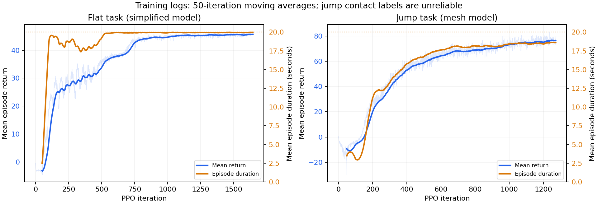

# 为什么几千轮就能行走，以及本次代码精简

## 日志实际显示了什么

本次读取的是以下两次运行的 TensorBoard 日志快照，不是重新训练的结果：

- 平地：`logs/rsl_rl/wbr_plane/2026-08-27_11-43-41`，最后一轮 1646。
- 跳跃：`logs/rsl_rl/wbr_jump/2026-08-27_15-05-46`，最后一轮 1272，日志截止 16:09:19。

下表是对应轮数之前 50 轮的均值；末尾行取最后 50 轮。回合长度按每控制步 0.01 秒换算。

| 训练阶段 | 平地平均回报 | 平地平均回合长度 | 跳跃平均回报 | 跳跃平均回合长度 |
| --- | ---: | ---: | ---: | ---: |
| 150–199 | 26.28 | 18.47 s | 19.58 | 11.14 s |
| 450–499 | 33.73 | 19.18 s | 58.71 | 16.73 s |
| 950–999 | 44.65 | 19.91 s | 73.16 | 18.43 s |
| 各自最后 50 轮 | 45.70 | 19.98 s | 76.40 | 18.61 s |

平地的学习进展在数百轮时已经很明显，约千轮时平均回合长度接近 20 秒上限。
但回合长度不是行走成功率：终止条件是严重倾斜持续约一秒，不能单凭“存活”判断
速度误差、姿态误差或实机可靠性。日志中的速度跟踪奖励仍在改善，速度课程上限也从
2.0 m/s 增长到 2.5 m/s。

## 为什么不需要等到 50000 轮

1. **迭代次数不是样本数。** 平地每轮采集 `8192 × 48 = 393216` 条环境转移，
   1000 轮约为 **3.93 亿**条；跳跃每轮 `4096 × 48 = 196608` 条，1000 轮约为
   **1.97 亿**条。每轮还进行 5 epochs × 4 minibatches 的 PPO 更新，以及同样轮次
   的编码器监督更新。几千轮并不是只看过几千个状态。
2. **控制器和机构已经提供了基础能力。** 策略输出四个腿部位置偏置和两个轮速指令，
   由 1 kHz PD 控制落实，并有闭链约束、固定初始姿态及气弹簧支撑。当前平地任务
   主要学习平衡与轮速跟踪，不需要先学交替抬腿步态，也不是直接探索全部关节力矩。
3. **学习信号密集、任务范围有限。** 每步都有速度、转向、姿态等奖励；历史编码器
   用真实机体速度监督，critic 也能读取特权状态。地形是平面，机器人自碰撞关闭，
   当前平地 `collision` 奖励恒为零。这些条件比复杂地形、完整碰撞约束或实机更容易。
4. **play 本身更容易。** 它关闭观测噪声和启动参数随机化，并使用策略均值动作。
   目测 play 能行走，不代表带探索噪声和随机化的所有训练环境都同样稳定。
5. **50000 是最大预算，不是最低需求。** 达到所需的速度跟踪、存活和扰动恢复标准后，
   不必为了跑满配置继续等待。当前仅凭日志还不能给出严格的最佳停止轮数。

以上机制解释与日志一致，但没有进行消融实验，不能量化各因素分别带来多少加速。

**不能把这次平地学习归因于更换完整 MJCF。** 平地运行在 13:51 已结束，完整网格于
13:57 后接入；保存的平地配置也仍列出旧模型的 5 个受罚碰撞几何，而跳跃配置列出
新模型的 13 个。两个运行的任务、模型和训练样本量不同，不能直接对比回报。

## 跳跃指标发现的原有问题（现已修复）

`Episode_Reward/takeoff_extend` 在这份跳跃日志中始终为零。进一步在 CPU 上加载
`model_1200.pt`，4 个 play 环境试跑 100 个控制步：400 个环境样本里，有 227 个样本
的轮子接触力模长超过 1 N，但这 227 个样本全部被 `in_flight` 标记为腾空。
实测接触力 Z 分量范围为 `[-1694.41, 0] N`。

`wheel_contact` 使用 `reduce="netforce"`，输出的是全局坐标力。问题不是坐标系，
而是符号：当前 primary/secondary 配对下接地时 Z 分量为负，旧 `WbrState._refresh_contacts`
却用 `force[..., 2] > 1.0` 判断接地。因此腾空奖励可能在接地时发放，起跳伸腿条件
反而无法触发。**跳跃回报上涨不能证明学会有效起跳。**

这项问题在精简前已经存在，最初的等价重构保留了该行为。随后按用户要求单独修复：

- 接地条件改为匹配轮地接触且 `abs(force_z) > 1 N`。它适用于本项目的水平地面，
  不依赖 primary/secondary 的受力符号；仍保留原有一帧接触丢失滤波。
- 同时纠正 `encourage_jump` 中累计量的清零条件。原来的 `*= ~in_flight` 会在地面
  累计、空中清零；现在改为 `*= in_flight`，保留高度加权累积和奖励系数，空中累计，
  落地结算后清零，不再持续发放站地累计奖励。

复用同一 `model_1200.pt`，4 个 CPU 环境运行 100 个控制步，在状态更新时同步采样：
400 个样本中仍有 227 个轮子承载样本，旧判定误标腾空 227 次，新判定 **0 次**；
承载时 `flight` 奖励非零 **0 次**，`takeoff_extend` 在 196 个样本中正常触发。
观测和奖励均为有限值。该短测证明状态判定已修正，不代表策略已学会成功跳跃。

完整网格模型还验证了接地、离地滤波、腾空、落地结算和回合重置。修复后的回归测试
19 项通过，1 项 ONNX 对照因缺少 `onnxruntime` 跳过。

运行中的进程需要重启才能加载修复。没有更改网络、奖励系数或 checkpoint；旧权重
可加载，但跳跃奖励语义已经修正，应新开运行训练/评估，不直接比较修复前后的总回报。

## 精简后的代码职责

| 文件 | 职责 |
| --- | --- |
| `robot.py` | MJCF 加载、模型适配和机器人/控制周期常量 |
| `mdp.py` | 状态缓存、控制、观测、命令、随机化与 mjlab 回调 |
| `rewards.py` | 两类任务的奖励权重、公式和裁剪辅助函数 |
| `task.py` | 共享环境工厂，组装 plane/jump 与 train/play 配置 |
| `rl.py` | 网络、PPO、checkpoint 和 ONNX；超参数只在配置类定义一次 |
| `__init__.py` | 用同一注册流程注册两个任务 |

奖励派发现在只执行选中的分支，不再为每个奖励调用创建整套 lambda 字典。
PPO 共用一份参数配置和一份优化参数列表；观测配置共用 frame 构造逻辑。
原有 mjlab 回调入口、任务 ID、观测/动作维度、网络权重名和 checkpoint 字段保留。
没有修改模型、奖励公式/权重、步长、随机化范围或训练预算。

## 等价重构阶段的验证（接触修复之前）

- 回归测试 16 项通过，ONNX 对照因缺少 `onnxruntime` 跳过；覆盖完整奖励公式、
  裁剪和有状态的 air-time 更新，以及原有模型/环境/学习测试。
- 与修改前代码逐项比较四种环境配置（plane/jump × train/play）和两种 runner 配置。
- 固定随机种子，以默认和非默认超参数比较 PPO/编码器更新；损失、权重、优化器状态
  以及 PyTorch RNG 状态逐位一致。
- 实际平地 `model_1600.pt` 与跳跃 `model_1200.pt` 均可恢复模型和优化器，推理输出
  与修改前逐位一致。
- 两类环境各以 4 个 CPU 环境运行 20 个控制步，修改前后观测、奖励、终止标志和
  air-time 状态逐位一致。
- 没有启动新的长训练，也没有修改现有 checkpoint。
